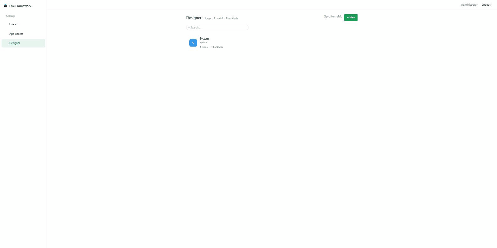
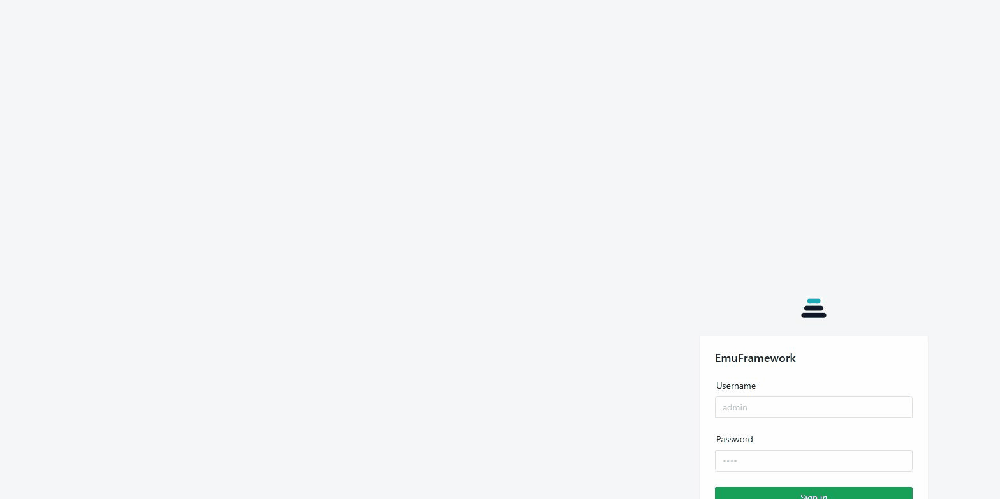
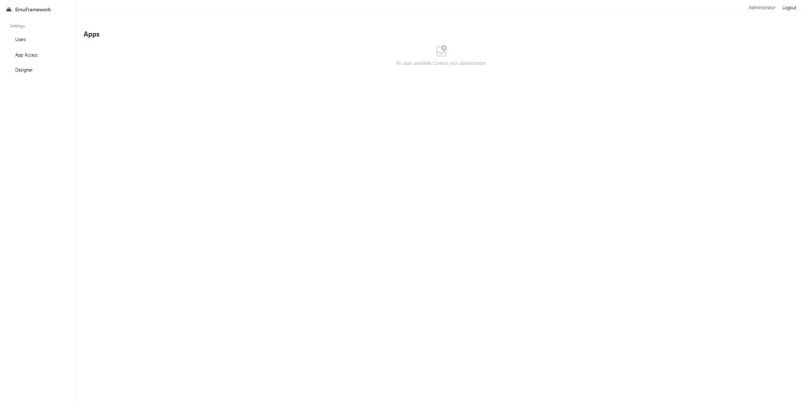
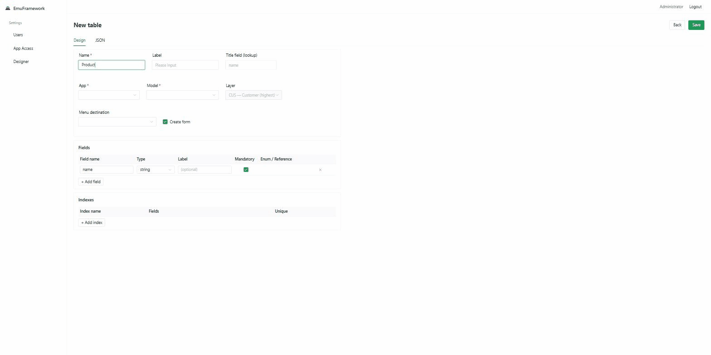
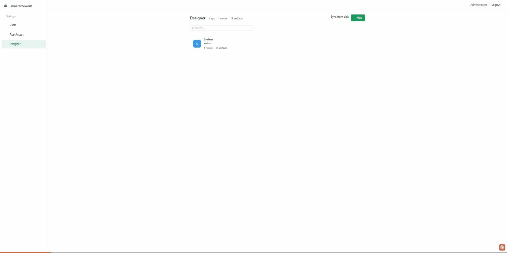

# Web Designer Guide — Customize EmuFramework from Your Browser

**Version: v0.0.0.8**

## Simple Builder (recommended)

Open **Designer** and keep **Simple Builder** selected. The guided flow asks for an App,
Entity, Fields, Page, and Navigation label. It then validates the complete change set and
shows a review screen before anything is applied. The generated artifacts use the
`Customizations` model and `CUS` layer automatically.

Use **Advanced** when you need direct access to models, layers, individual artifacts,
extensions, security objects, reports, or scripts. Script changes are marked high-risk and
require a separate confirmation.

This guide is for anyone who wants to customize an EmuFramework app **without writing code** —
admins, business analysts, or power users. Everything here happens inside the **Web Designer**,
a page built into the app itself. If you're a developer looking for the code-based path
(metadata files, hooks, TypeScript logic), see the
[Developer Guide](DEVELOPER-GUIDE.md) instead — this document only covers the browser UI.

## Table of Contents

1. [What the Web Designer Is](#1-what-the-web-designer-is)
2. [Opening the Web Designer](#2-opening-the-web-designer)
3. [Creating a New App](#3-creating-a-new-app)
4. [Creating a Table (with a Form and Menu)](#4-creating-a-table-with-a-form-and-menu)
5. [Adding Fields to an Existing Table](#5-adding-fields-to-an-existing-table)
6. [Creating a Standalone Form, Menu, or Enum](#6-creating-a-standalone-form-menu-or-enum)
7. [Editing Raw JSON](#7-editing-raw-json)
8. [Deleting Something You Created](#8-deleting-something-you-created)
9. [Good Habits and Key Rules](#9-good-habits-and-key-rules)
10. [What You Can't Do from the Browser (Yet)](#10-what-you-cant-do-from-the-browser-yet)

---

## 1. What the Web Designer Is

Think of the Web Designer as a way to build small database-backed screens — tables of records,
the forms used to edit them, and the menu items that link to them — directly from your browser,
while the app is running. There's nothing to install, no server restart, and no code to write.

Everything you create is saved to the database immediately and shows up in the app's sidebar
right away, for every user who has access to it.

---

## 2. Opening the Web Designer

1. Log in with an administrator account (or any account with designer access).
2. In the left sidebar, under **Settings**, click **Designer**.

You'll land on the Designer home page, which lists every app currently on the system and how
many tables/artifacts each one has.

---

## 3. Creating a New App

An **app** is the top-level grouping — think of it as its own folder in the sidebar, with its
own name and its own set of tables. You only need to create a new app once per project; after
that, everything else (tables, forms, menus) gets added under it.

1. On the Designer page, click **+ New**.
2. Choose **App (new domain)**.
3. Fill in:
   - **Name** — a short, lowercase identifier with no spaces (e.g. `inventory`). This is used
     internally and can't be changed later.
   - **Label** — the friendly name shown in the sidebar (e.g. `Inventory`).
4. Click **Save**.

Your new app immediately appears in the sidebar as its own group — currently empty, ready for
tables.

---

## 4. Creating a Table (with a Form and Menu)

A **table** stores your data — think of it like a spreadsheet with named columns (called
**fields**). Creating a table from the Designer can also generate the **form** (the screen used
to add/edit one record) and the **menu item** (the sidebar link that opens it), all in one step.

1. On the Designer page, click **+ New**.
2. Choose **Table (+ form + menu)**.
3. **Choose the App** — pick which app (sidebar group) this table belongs to. If you just
   created a new app in step 3, select it here.
4. **Choose a menu destination** — where should the sidebar link for this table appear?
   - Pick an existing menu (e.g. `MainMenu`) to add your item alongside what's already there.
   - Pick **(new menu for ...)** to have the Designer create a brand-new menu for this app.
5. Fill in the table's **Name**, **Label**, and its **Fields** (each field needs a name, a
   label, and a type — text, number, date, reference to another table, etc.).
6. Check **Create form** so the Designer builds an edit screen for you automatically.
7. Click **Save**.

The table, its form, and its menu item all appear in the sidebar immediately — no page reload,
no server restart.

---

## 5. Adding Fields to an Existing Table

You don't need to touch the original table to add a field to it — even one that came from the
base app rather than something you built yourself. This is called an **extension**, and it
never modifies the original.

1. On the Designer page, find the **Customize existing tables** section.
2. Click the name of the table you want to extend.
3. Add the new field(s).
4. Click **Save**.

Behind the scenes the Designer records this as an extension, so the original table definition
is untouched — if that table ever gets updated by a developer, your added field stays intact.

---

## 6. Creating a Standalone Form, Menu, or Enum

Sometimes you need just one of these pieces on its own, rather than the full table+form+menu
bundle from Section 4:

- **New… → Form** — pick an existing table, then choose which fields show in the list view and
  how fields are grouped on the edit screen.
- **New… → Menu** — pick which items belong in it, and which form each item should open.
  Menus support multiple levels (a menu can contain sub-menus).
- **New… → Enum** — define a fixed list of choices (e.g. `Draft / Approved / Rejected`) that a
  field can use as a dropdown.

---

## 7. Editing Raw JSON

Every artifact the Designer creates is really just structured JSON under the hood. For
anything the visual editor doesn't have a dedicated control for — or if you're comfortable
editing the JSON directly — switch to the **JSON** tab on any artifact's edit screen, make your
change, and click **Save**.

---

## 8. Deleting Something You Created

Click the **Del** button next to any artifact in the Designer to remove it.

Important: deleting an artifact removes it from the app and the sidebar, but it **never drops
the underlying database column or table**. Schema changes made through the Designer are
additive-only — your existing data is never destroyed, it just stops being shown on screen. If
you re-create the same field or table later, the old data is still there.

---

## 9. Good Habits and Key Rules

- **Always pick the right App** when creating something — it determines which sidebar group it
  shows up in.
- **Prefer an existing menu** over creating a new one, unless you're intentionally starting a
  new section of the sidebar.
- **Nothing requires a server restart.** Every save applies live, for every logged-in user.
- **Renaming the system's display name** (the text shown on the login page and sidebar) isn't
  done from the Designer — it's set once by whoever deploys the app, via the `EMU_APP_TITLE`
  environment variable.

---

## 10. What You Can't Do from the Browser (Yet)

The Web Designer is intentionally limited to keep it safe for non-developers to use. A few
things still require a developer and the code-based path (see the
[Developer Guide](DEVELOPER-GUIDE.md)):

- **Access control** — you can't create a privilege, duty, or role from the browser yet. Tables
  you create are only visible to admins until a developer grants access through a metadata file.
- **Business logic** — validation rules, automatic calculations, and anything that reacts to
  data changing (hooks, events, actions) still has to be written in TypeScript.
- **Renaming an existing file-based object** — if a table/form/menu already exists as a file in
  the codebase, the Designer can't create something with the exact same name. Use the
  **Customize existing tables** flow from Section 5 instead.

If you run into one of these limits, that's the point where it's time to loop in a developer.
